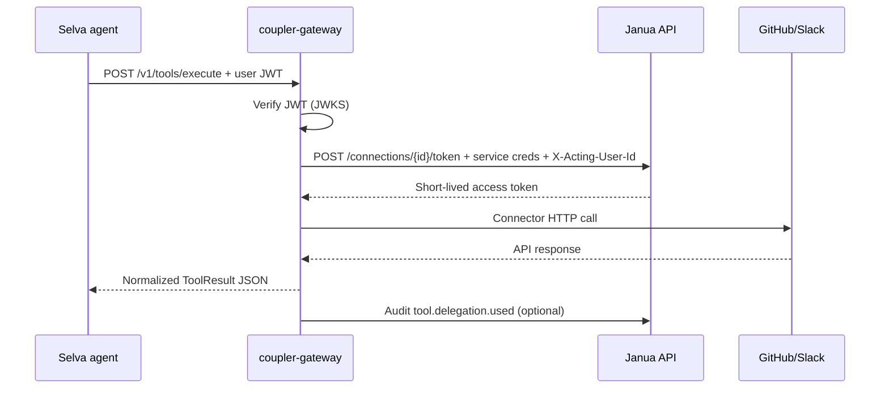

# Separation of concerns — Coupler × Selva × Janua × Enclii

## Platform boundary matrix

| Concern | Janua | Enclii | Selva | Coupler |
|---------|-------|--------|-------|---------|
| Human login / SSO | ✅ | ❌ | consumes JWT | validates JWT |
| ConnectedAccount vault | ✅ | ❌ | ❌ | delegates at execute |
| OAuth authorize UX | ✅ | ❌ | redirects users | ❌ |
| Token delegation to ATP | ✅ | ❌ | ❌ | consumes |
| k8s deploy / domains | ❌ | ✅ | ❌ | onboarded like any repo |
| Operator infra (`madfam.ops.*`) | admin JWT | ✅ Provider Hub | proxy via Coupler P4 | proxy only |
| LLM routing / agent graphs | ❌ | ❌ | ✅ | ❌ |
| MADFAM ecosystem tools | ❌ | ❌ | ✅ builtins + adapters | ❌ |
| Third-party SaaS execute | ❌ | ❌ | ❌ consumes | ✅ |
| Tool catalog / search | ❌ | ❌ | discovers via API | ✅ |
| MCP for Cursor/dev | ❌ | ❌ | optional client | ✅ server |
| Audit `tool.delegation.*` | ingest ✅ | ❌ | ❌ | emit |
| Billing / entitlements | Dhanam | ❌ | consumes | ❌ |

## Trust zones (tool prefixes)

```
coupler.{connector}.{action}   →  end-user delegated SaaS
madfam.ops.{domain}.{action}     →  platform operator (Enclii proxy)
madfam.app.{repo}.{action}       →  ecosystem-registered app tools (future)
{selva builtin names}            →  Selva registry (unchanged)
```

## Selva refactor playbook

### Keep unchanged

- All MADFAM-specific builtins (Karafiel, Dhanam, PhyndCRM, Tezca, Crawler, A2A)
- Audience model (`PLATFORM` vs `TENANT`)
- Nexus gateway ingress (18 channels)
- Resend outbound email gateway
- Platform infra tools until Enclii Provider Hub absorbs them

### Add (P3)

- `packages/tools/src/selva_tools/backends/coupler.py` — `CouplerToolBackend`, `CouplerProxyTool`
- Registry hook `discover_coupler_tools()` behind `SELVA_COUPLER_TOOLS_ENABLED`
- Worker passes `user_jwt` into Coupler execute via execution context

### Deprecate gradually (P4)

| File | Action |
|------|--------|
| `builtins/slack.py` | Route to Coupler when flag on; log deprecation |
| `mcp_config.json` `github` server | Replace with Coupler MCP in dev |
| `packages/calendar/` direct Graph/Google | Future Coupler calendar connectors |
| Social tools (reddit/mastodon/bluesky) | Coupler connectors when prioritized |

### Selva internal cleanup (parallel, not blocking Coupler)

1. Unify tool resolution for workers + YAML workflows
2. Wire or remove unused `McpToolAdapter` / ACP bootstrap
3. Merge plugin tool specs into registry or document intentional split

## Janua refactor playbook (P1)

| Legacy | Coupler-ready |
|--------|---------------|
| `GET /integrations/{provider}/token` (user JWT, returns refresh) | `POST /connections/{id}/token` (service JWT + `X-Acting-User-Id`) |
| `OAuthAccount` (login link) | `ConnectedAccount` (tool connections) |
| `oauth_accounts` table | `connected_accounts` + `provider_types` |

**Bridge:** `sync_from_oauth_account()` seeds ConnectedAccount from existing GitHub/Slack login links for migration.

## Coupler hard rules (enforced in code review)

1. No refresh token persistence in Coupler DB
2. No imports of Enclii/Janua server packages
3. No `kubectl` / cluster mutation
4. No Composio Cloud APIs
5. AGPL-3.0-only public repo

## Data flow (user-delegated execute)



## Anti-patterns (do not do)

- Embedding Slack SDK in Selva worker graphs
- Storing GitHub PAT in Selva env for per-user repo access
- Adding connector logic to Enclii `switchyard-api`
- Using `/integrations/github/token` from Coupler service account
- Duplicating OAuth flows in Coupler (Janua owns authorize/callback)
