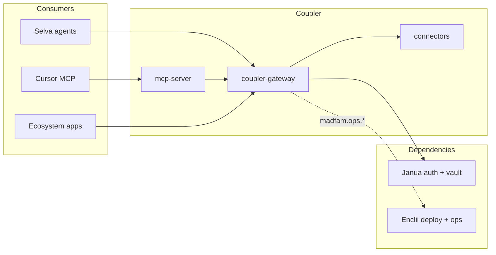

# Coupler architecture overview

Coupler implements the **Agent Tool Plane (ATP)** for MADFAM: a sovereign alternative to Composio-class tool orchestration.

## Components



## Phase 0 scope (this repo)

1. **Gateway** — HTTP API: health, list tools, search, dry-run execute
2. **Registry** — Load tool definitions from `connectors/*/manifest.yaml`
3. **MCP** — stdio server exposing catalog tools to Cursor
4. **Manifests** — GitHub + Slack connector stubs

## Phase 1+ (not in P0)

- Janua token delegation on live execute
- Postgres audit log + idempotency
- OAuth connect flows via Janua
- Sandbox workers (Firecracker)
- Trigger webhooks + Selva workflow hooks

## API surface

See [../openapi/coupler-v1.yaml](../openapi/coupler-v1.yaml).

## Monorepo layout

```
coupler/
├── apps/gateway/           # Go HTTP API
├── packages/mcp-server/    # Python stdio MCP
├── packages/sdk-typescript/
├── connectors/
│   ├── github/
│   └── slack/
├── k8s/production/
├── docs/
├── enclii.yaml
└── janua.client.yaml
```
